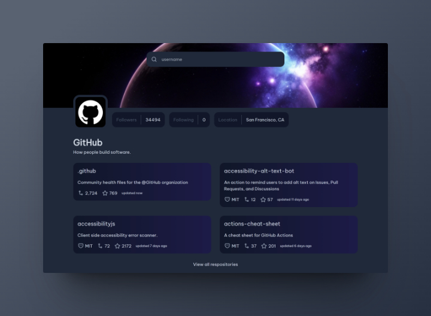

# 👤 GitHub Profile

This is a solution to the [GitHub Profile challenge on devChallenges](https://devchallenges.io/challenge/42). devChallenges help you improve your coding skills by building realistic projects.

## 📌 Links

- Solution URL: [GitHub](https://github.com/NahuelEF/github-profile.git)
- Live Site URL: [Netlify](https://nahuelef-github-profile.netlify.app/)

## 🎯 The challenge

The challenge requires creating a Github Profile search application that utilizes multiple API endpoints. The Github Profile search app requires the use of multiple APIs, such as the Github REST API, which returns information about a repository as a JSON.

### User stories:

- [x] Create a Github profile page that matches the given design.
- [x] Use HTML to create the basic structure.
- [x] Add inputs, images, buttons,.. according to the design.
- [x] Use JavaScript to add interactivity.
- [x] Users should be able to search for user by user name.
- [x] User should be able to see the number of followers, following, and location.
- [x] User should be able to see the repositories that profile has.
- [x] User should be able to see the details of each repository.
- [x] When users select repository card, they should be able to see the repository page in the new tab.
- [x] When users select repository card, they should be able to see the repository page in the new tab.
- [x] The page should be responsive on different screen sizes.

## 🛠 Built with

- Responsive Design
- Flexbox
- CSS Grid
- [Vite](https://vitejs.dev/) - Build tool
- [TypeScript](https://www.typescriptlang.org/)
- [React](https://reactjs.org/) - JS library
- [TailwindCSS](https://tailwindcss.com/) - For styles

## 👨‍💻 Author

- devChallenges - [@NahuelEF](https://devchallenges.io/profile/8d7834ba-98e7-4f82-82d9-1cea286338a3)

